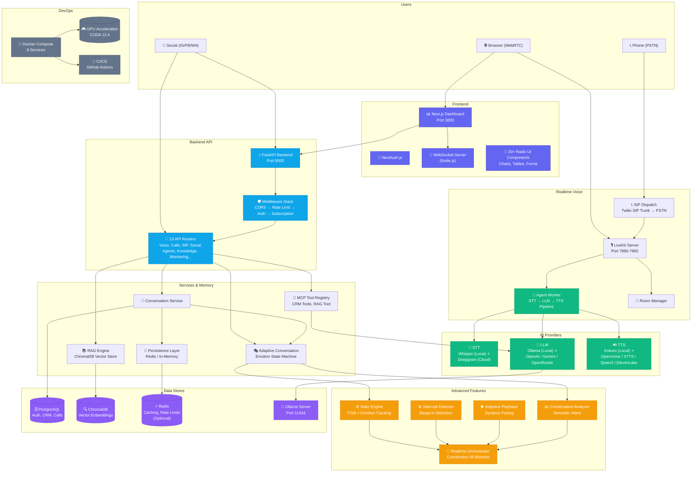

# VoiceAI Orchestrator — Architecture Overview



## Component Map

| Layer | Component | Technology | Status |
|-------|-----------|------------|--------|
| **Frontend** | Dashboard | Next.js 16 / React 19 / TypeScript | ✅ 24 pages |
| **Frontend** | UI Components | Radix UI / Tailwind / Recharts | ✅ 20+ components |
| **Frontend** | WebSocket Server | Node.js / ws | ✅ Real-time bridge |
| **API** | REST Backend | FastAPI / Python 3.12 | ✅ 13 routers |
| **API** | Middleware | JWT / Token Bucket | ✅ Auth + Rate Limit |
| **AI** | STT | Whisper (local) / Deepgram | ✅ 2 providers |
| **AI** | LLM | Ollama / OpenAI / Gemini / OpenRouter | ✅ 4 providers |
| **AI** | TTS | Kokoro / OpenVoice / XTTS / Qwen3 / ElevenLabs | ✅ 5 providers |
| **Voice** | Transport | LiveKit WebRTC | ✅ Full integration |
| **Voice** | Telephony | SIP / Twilio PSTN | ✅ Phone calls |
| **Memory** | Vector Store | ChromaDB + SentenceTransformers | ✅ RAG enabled |
| **Memory** | Persistence | Redis / In-Memory fallback | ✅ Dual mode |
| **Advanced** | State Engine | FSM + Emotion Tracking | ✅ 12+ scenarios |
| **Advanced** | Interrupt | Barge-in Detection | ✅ Real-time |
| **Advanced** | Playback | Adaptive Pacing Engine | ✅ Per-emotion profiles |
| **Advanced** | Analyzer | Semantic + Keyword | ✅ Hybrid |
| **Infra** | Containers | Docker Compose | ✅ 8 services |
| **Infra** | GPU | CUDA 12.4 | ✅ Auto-detection |
| **Infra** | CI/CD | GitHub Actions | ✅ Backend + Dashboard |

## Data Flow: Voice Call

```
User speaks → LiveKit captures audio
           → Agent Worker receives frames
           → STT (Whisper) transcribes to text
           → Orchestrator processes through State Engine
           → Adaptive Conversation determines emotion
           → LLM (Ollama) generates response
           → TTS (Kokoro) synthesizes speech
           → Agent Worker publishes audio back to LiveKit
           → User hears response
```
